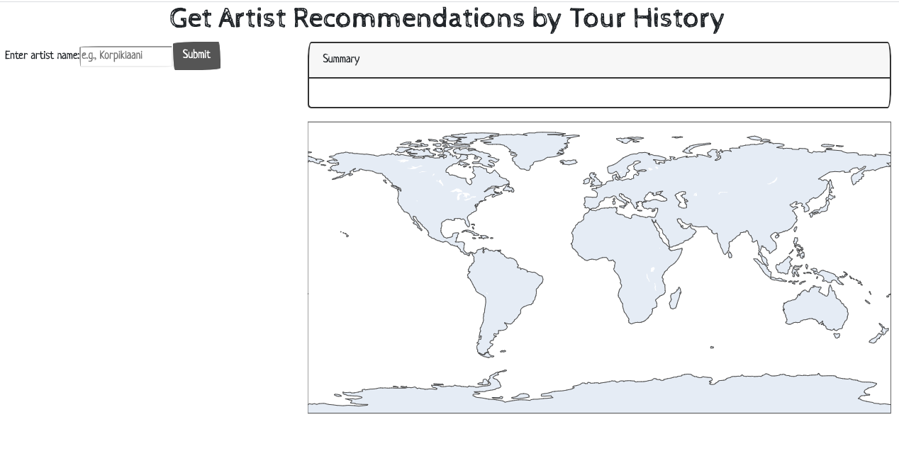
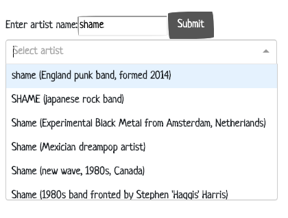
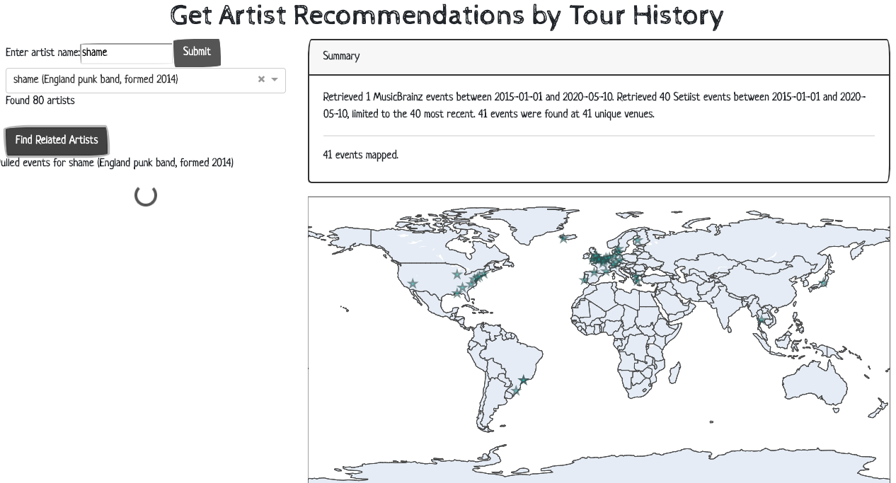
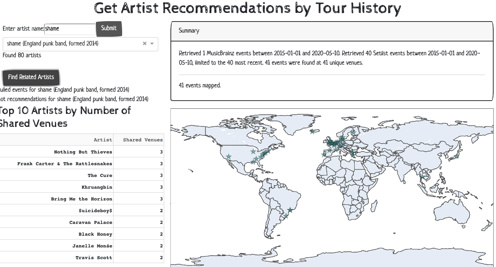
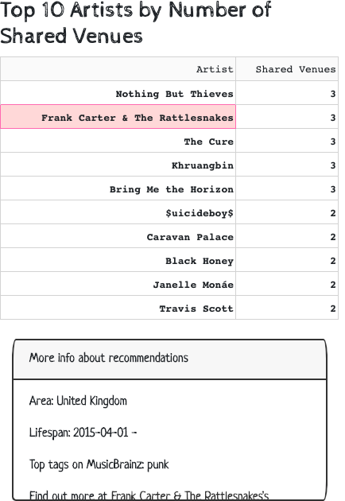
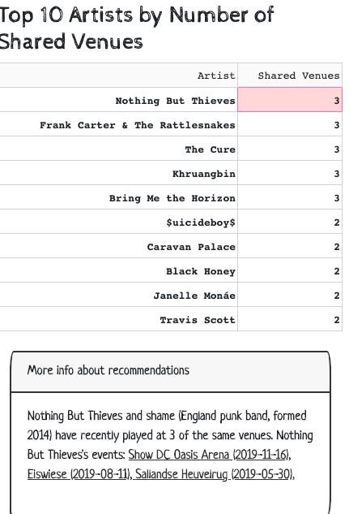
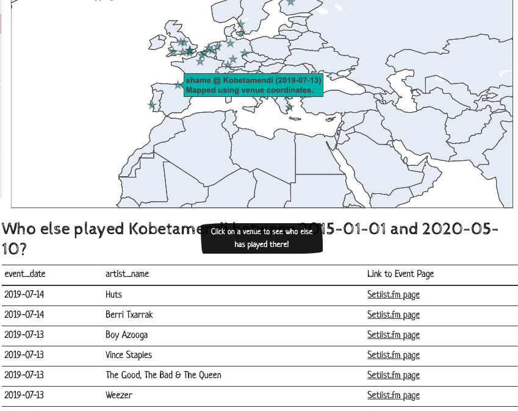

# Artist Recommendations Based on Event Data

We explore the task of musical artist recommendation using live event data. Music festivals and concerts with shared bills provide attendees with the opportunity to discover new artists, and much of that information is available from crowdsourced databases of event data. We present a prototype recommendation system that aggregates event data from MusicBrainz and Setlist.fm and to find sets of artists who have performed at the same venues.

## Related Work

Music recommendation systems are a major topic in the music information retrieval literature. Celma (2010) provides an overview of the music recommendation task and common approaches, including methods for collaborative filtering (based on user listening habits or ratings), context-based filtering (based on cultural information, such as tags), content-based filtering (based on analyses of the audio content), and hybrid methods. Collaborative filtering systems are prone to the cold-start problem, in which systems have difficulty generating recommendations for new users or recommending new items due to a lack of associated ratings (Schedl et al. 2018). Due to the right-skewed distribution of items by popularity in many databases, collaborative filtering systems are susceptible to popularity bias; recommending popular items reinforces their popularity and this can prevent more obscure artists from getting recommended (Celma and Cano 2008). By taking a context-based approach, an event-based recommendation system could avoid these problems. 

Some recent papers have used musical event data to address various research questions. Krasanakis et al. (2018) used event data from Facebook and artist information from Spotify to explore the relationship between artist and venue popularity. Arakelyan et al. (2018) used Songkick event data to forecast artist success, predict the venues at which an artist will perform, and perform joint discovery of influential artists and venues. Akimchuk et al. (2019) explored the possibility of using event data from Ticketfly and Facebook to build a local music recommendation system. Finally, Allik et al. (2018) present MusicLynx, a graph-based system for artist discovery. In MusicLynx, artists are linked by different types of relationships mined from sources like MusicBrainz, DBpedia, AcousticBrainz, Last.fm, and Wikidata, and presented as a color-coded graph for the user to explore.

## Sources of Event Data
We chose to use MusicBrainz and Setlist.fm as our sources of event data. No key is required to use the MusicBrainz API methods, and the process for obtaining a Setlist.fm API key was relatively quick and straightforward compared to the API key application process for sites like Songkick or Bandsintown. In addition, MusicBrainz and Setlist.fm have API methods for pulling all past events by venue or artist, while the Songkick API has a method for pulling past events by artist but not by venue.

MusicBrainz was launched in 2000 as a free alternative to the Internet Compact Disc Database. Initially, MusicBrainz was a place for users to add track and title information for CDs, but its metadata schema has expanded to include more entities and attributes over time. Each entity in MusicBrainz is assigned a permanent unique alphanumeric identifier known as its MBID (Swartz 2002). Events were added as entities in 2015. As of 7 May 2020, the MusicBrainz database contained 41,807 Events, most of which were of type Concert (66%) or Festival (27%). It had 36,805 Event-Place relationships (i.e., “[Event] was held at [Place]”) and 114,017 Artist-Event relationships (e.g., “[Artist] was a main performer at [Event]”, “[Artist] was a support act at [Event]”).[1](#1) Setlist.fm was founded in 2008 as a “wiki-like service to collect and share setlists.”[2](#2) As of 7 May 2020, the Setlist.fm database contained approximately 5 million setlists for 232,000 artists and 333,000 venues.[3](#3) Since MusicBrainz and Setlist.fm are populated by user contributions, the number of entries and the amount of detail included for existing entries are constantly growing. In MusicBrainz, one Event may be tied to multiple Artist entities that performed at the event through Artist-Event relationships. However, in Setlist.fm, events with shared bills are split into separate setlists for each artist. Events in MusicBrainz have few required fields; for example, an event may be added to the MusicBrainz database without an associated venue or artist. The Setlist.fm schema is stricter and events pulled with the Setlist.fm API are guaranteed to have a specific set of fields.

<a class="anchor" id="1">1:</a> Statistics on https://musicbrainz.org/statistics, accessed 7 May 2020

<a class="anchor" id="2">2:</a> https://www.setlist.fm/about

<a class="anchor" id="3">3:</a> Statistics on https://www.setlist.fm/, accessed 7 May 2020

## Methodology

The process for generating recommendations is as follows, given a query artist: 

1. Pull the query artist’s most recent events
2. Pull the most recent events for each venue in the query artist’s event list
3. Rank artists associated with resulting events by number of unique venues
4. Return the artists with the most venues in common with the query artist (the number of times artists have performed at each venue is not considered) 

The data pulling process becomes more complicated with multiple sources of event data. While both MusicBrainz and Setlist.fm use MBIDs to identify artists, they do not use a common identifier for venue and event entities. Taking inspiration from the Event Ontology, we use a simplified standard representation of event metadata to enable the combination of event data from different sources (Raimond et al. 2007). We define Python classes for Artist, Venue, and Event entities with methods to load in event data from MusicBrainz and Setlist.fm and a minimal set of attributes from each source to uniquely identify the entity, allow for future API queries, and generate useful human-readable representations of the entity in the application. More information about the attributes included in each class can be found in Appendix I. Given Event objects _e1_ and _e2_, we assume that if _e1_ and _e2_ have the same date and _e1_’s artist list is a subset of _e2_’s artist list, _e1_ and _e2_ are the same event, although there is a possibility for error in this method if an artist has multiple performances in the same day. When we merge Event objects on this basis, we can also find new mappings between venues (i.e., if _e1_ and _e2_ are determined to be the same event, assume their associated venues are also the same) and apply those to other events.

The ability to map between MusicBrainz and Setlist.fm venues then allows us to query both sources when pulling events by venue and thus get a more complete set of events and candidate artists for recommendation. In addition to the venue mappings obtained as a byproduct of event merging, the application has access to a set of predetermined mappings for 3371 venues. These venue mappings were found using the following method: we crawled MusicBrainz to pull 34,096 events (82% of all MusicBrainz Events) for 7829 venues. Of these venues, 3388 had geolocation data; for each of these, we searched the venue name in Setlist.fm. For each resulting Setlist.fm venue, we calculated the distance between the MusicBrainz venue coordinates and the Setlist.fm city coordinates, filtering out all venues with more than 25 km between coordinates. For the remaining potential matches, we measured the similarity between the MusicBrainz and Setlist.fm venue names using the Levenshtein distance and selected the venue with the closest name for the mapping. 

We provide a simple graphical user interface that allows the user to type in an artist’s name, select their intended artist from a dropdown list of relevant results, generate recommendations for the selected artist, and repeat this process any number of times. This was built with the Dash framework for Python. Screenshots of different states of the application can be found in Appendix II.

## Future Work

The web application’s usability and performance could be improved. Future work in these areas could include changing the layout and style of the user interface to make it more aesthetically pleasing and easier to use and providing the user with more options (e.g., to change the timeframe of events considered and the number of recommendations returned). We could also make better use of the Event-URL relationships in MusicBrainz to check if events and venues are already tied to Setlist.fm entities. More sophisticated map visualization methods could be used to display venues with the same city coordinates.

The scope of this initial system was limited, and there are several directions that would be worth pursuing in the next stage. The Event, Artist, and Venue representations used in this system were designed with extensibility in mind, and we would like to incorporate events from more sources. In the early stages of this project, we considered using the SPARQL endpoint developed for the Live Music Archives (LMA), but since the LMA only has event data for certain tape-friendly bands, it has limited utility as a source of recommendations for artists outside of the jam band genre (Bechhofer et al. 2013). Still, it may be worthwhile to add methods to convert entities to RDF representations and shift to a Linked Data approach similar to that used by Bechhofer et al. (2013). Based on Krasanakis et al. (2018) and Arakelyan et al.’s (2018) use of bigraph algorithms to simultaneously rank artists and venues, we initially experimented with graph-based methods for generating recommendations. Due to limited time and computing resources, we took a simpler approach for this version, but it would be worth looking at more graph clustering algorithms and network visualization methods; we already have methods in place for creating Artist-Venue bigraphs from Event, Artist, and Venue objects. 

## Conclusion

The prototype recommendation system introduced here provides an alternate method of artist discovery, but it is not meant to replace collaborative-filtering or content-based recommendation systems. In fact, we can envision this as one component of a hybrid approach that uses content-based methods to generate playlists of songs by the artists recommended by the event-based system. The process of pulling event data from different sources highlighted the importance of metadata standards and, in particular, authority control for musical entities. More widespread adoption of MBIDs across music information systems would make it easier to combine data from different sources. It was convenient to be able to use the MBID to query the Setlist.fm API for events by artist, and it would have been even more convenient to be able to use venue MBIDs as well. However, the latter would only be possible if every venue in Setlist.fm had a corresponding entry in MusicBrainz, and based on the initial project scope of MusicBrainz and the current database statistics, adding Place data is likely not as high a priority to editors as Artist information.

## Bibliography

Akimchuk, Daniel, Timothy Clerico, and Douglas Turnbull. 2019. “Evaluating Recommender System Algorithms for Generating Local Music Playlists.” https://arxiv.org/abs/1907.08687

Allik, Alo, Florian Thalmann, and Mark Sandler. 2018. “MusicLynx: Exploring Music Through Artist Similarity Graphs.” In Companion Proceedings of the The Web Conference 2018 (WWW ’18), 167–70. https://doi.org/10.1145/3184558.3186970

Arakelyan, Shushan,  Fred Morstatter, Margaret Martin, Emilio Ferrara, and Aram Galstyan. 2018. “Mining and Forecasting Career Trajectories of Music Artists.” In HT ’18: 29th ACM Conference on Hypertext and Social Media. https://doi.org/10.1145/3209542.3209554

Bechhofer, Sean, Kevin Page, and David De Roure. 2013. “Hello Cleveland! Linked Data Publication of Live Music Archives.” In 14th International Workshop on Image Analysis for Multimedia Interactive Services (WIAMIS), 1–4. https://doi.org/10.1109/WIAMIS.2013.6616155

Celma, Òscar. 2010. “Music Recommendation.” In Music Recommendation and Discovery: The Long Tail, Long Fail, and Long Play in the Digital Music Space, 43–85. Berlin, Heidelberg: Springer. https://doi.org/10.1007/978-3-642-13287-2_3

Celma, Òscar, and Pedro Cano. 2008. “From Hits to Niches?: Or How Popular Artists Can Bias Music Recommendation and Discovery.” In Proceedings of the 2nd KDD Workshop on Large-Scale Recommender Systems and the Netflix Prize Competition. http://doi.org/10.1145/1722149.1722154

Krasanakis, Emmanouil, Emmanouil Schinas, Symeon Papadopoulos, Yiannis Kompatsiaris, and Pericles Mitkas. 2018. “VenueRank: Identifying Venues that Contribute to Artist Popularity.” In Proceedings of the 19th International Society for Music Information Retrieval Conference (ISMIR 2018), 702–8. https://doi.org/10.5281/zenodo.1492513

Raimond, Yves, Samer Abdallah, Mark Sandler, and Frederick Giasson. 2007. “The Music Ontology.” In Proceedings of the 8th International Conference on Music Information Retrieval (ISMIR 2007). 

Schedl, Markus, Hamed Zamani, Ching-Wei Chen, Yashar Deldjoo, and Mehdi Elahi. 2018. “Current Challenges and Visions in Music Recommender Systems Research.” International Journal of Multimedia Information Retrieval 7 (2): 95–116.

Swartz, Aaron. 2002. “Musicbrainz: A Semantic Web Service.” IEEE Intelligent Systems 17 (1): 76–7. https://doi.org/10.1109/5254.988466

## Appendix I: Artist, Event, and Venue class attributes

Artist

- mbid: string, Artist MBID
- name: string, name of artist (same in MusicBrainz and Setlist.fm)

Venue

- id
	- mbid: string, Place MBID
	- slid: string, unique venue identifier from Setlist.fm 
- name
	- mbname: string, name of venue in MusicBrainz
	- slname: string, name of venue in Setlist.fm
- city
	- name: string, name of city in which venue is located
	- coords: tuple of float values for latitude and longitude of city
- coords: tuple of float values for latitude and longitude of venue

Event

- id
	- mbid: string, Event MBID
	- slid: string, unique setlist identifier from Setlist.fm
- time: date of event (datetime.date object)
- type: string, event type from MusicBrainz (e.g., “Concert”, “Festival”); None for Setlist.fm events
- artists: list of Artist objects
- venue: Venue object
- url
	- mburl: string, MusicBrainz URL for event
	- slurl: string, Setlist.fm URL for event

## Appendix II: Screenshots

Figure 1. Appearance of the application in its initial state

Figure 2. Example of process for inputting the query artist

Figure 3. Appearance of application after “Find Related Artists” button is hit and before recommendations have been generated

Figure 4. Appearance of application once recommendations have been generated

Figure 5. Examples of user interaction with the application via the recommendation table

Figure 6. Example of user interaction with the application via the venue map visualization